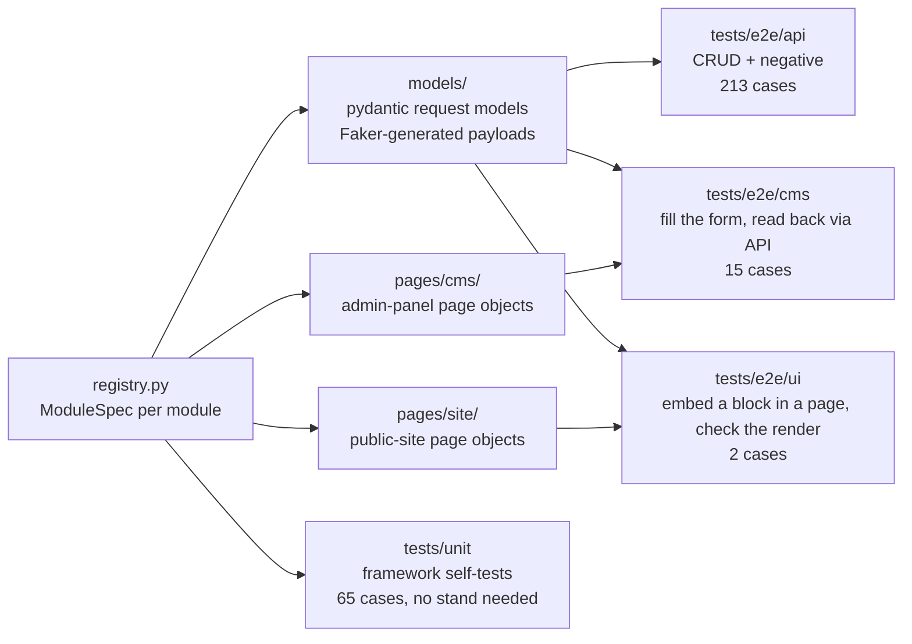

# cms-autotests

[](https://github.com/Clorhexidinum/auto_tests/actions/workflows/ci.yml)


A pytest + Playwright + Allure template for testing a content CMS on three levels at once:
the **REST API**, the **admin panel** that edits the content, and the **public site** that
renders it. One registry entry describes a CMS module for all three layers, and the tests
are parametrised from that registry.

The project started as a production suite (about 1000 generated test cases against a real
CMS) and was reduced to a template: the framework core is complete, 13 representative
modules show every technical pattern the core supports, and everything specific to the
original product was removed or renamed.

## How it works



* **API tests** post a generated payload, validate the response schema, and check that
  every field sent came back (`assert_echo`). Negative tests cover missing auth, malformed
  bodies, duplicates, wrong routes and unsupported verbs, and require the error envelope.
* **CMS tests** open the admin form, fill it from the same payload, save, then read the
  entity back through the API and compare field by field.
* **UI tests** create a block and a page that embeds it through the API, then open the public
  page and check the rendered block.
* **Unit tests** cover the framework itself (settings, HTTP client, assertions, cleanup,
  reference data, registry consistency, payload generation) and run in CI without any stand.

## Quick start

```bash
uv sync                         # create the environment and install dependencies
uv run playwright install        # browsers for the cms/ui suites
cp .env.example .env             # fill in the stand URLs and credentials

uv run pytest tests/unit         # framework self-tests, no stand needed
uv run pytest tests/e2e/api -n 4 # API suite, 4 workers
uv run pytest tests/e2e/cms --headed
uv run pytest tests/e2e/ui --browser firefox
```

Allure results land in `allure-results/`; render them with `allure serve allure-results`.

## Configuration

Settings are read from environment variables or `.env` by `cmstest/settings.py`
(pydantic-settings). Missing required values fail fast with the variable name.

| Variable | Required | Purpose |
|---|---|---|
| `API_BASE_URL` | yes | Content API root, e.g. `https://api.example.com/api/v3` |
| `CMS_BASE_URL` | yes | Admin panel root; forms open at `<CMS_BASE_URL>/<cms_path>` |
| `CMS_API_BASE_URL` | no | Admin auth API (login/logout). Default `<CMS_BASE_URL>/api/v1` |
| `SITE_BASE_URL` | no | Public site root. UI tests are skipped when unset |
| `API_KEY` | yes | Sent as the `api-key` header |
| `CMS_EMAIL`, `CMS_PASSWORD` | yes | Admin panel account; the session logs in once via the API |
| `TEST_PAGE_PATH` | no | Public page rendered by UI tests (default `/autotest`) |
| `VIEWPORT` | no | `WIDTHxHEIGHT`, default `1920x1080` |
| `REMOTE_BROWSER_WS` | no | `ws://` endpoint of a Playwright server or grid; unset = local browser |
| `BROWSER_TIMEOUT_MS` | no | Browser launch/connect timeout, default 240000 |
| `FAKER_LOCALE` | no | Locale for generated data, default `en_US` |
| `FAKER_SEED` | no | Fixed seed to replay a run; the seed of every run is printed in the report header |
| `GLOBAL_SEARCH_PATH` | no | Endpoint that finds entities by name across modules; unset disables the end-of-run sweep |

Browser choice and headless mode are pytest-playwright options: `--browser`, `--headed`,
`--slowmo`, `--tracing`, `--video`, `--screenshot`.

## Project layout

```
cmstest/
├── settings.py            Settings: the only place that knows about a concrete stand
├── registry.py            ModuleSpec + MODULES: one entry per CMS module, all layers
├── http/
│   ├── client.py          ApiClient over requests.Session (pooling, timeouts, Allure log)
│   ├── assertions.py      assert_response / assert_schema / assert_echo / json_value
│   ├── references.py      ReferenceData: cached lookups of existing entities for payloads
│   └── cleanup.py         CleanupStack: delete what a test created, in reverse order
├── models/                pydantic request models; every field has a Faker default_factory
├── pages/cms/             admin-panel page objects (CmsPage base + reusable components)
├── pages/site/            public-site page objects (scaffold, locators are project-specific)
├── data/                  enums, UI labels, Faker instance and run markers, fixture files
├── reporting/             Allure attachments
└── resources/             generated media fixtures for upload tests
tests/
├── conftest.py            Faker seed handling only; works without any configuration
├── unit/                  framework self-tests
└── e2e/                   api / cms / ui suites + fixtures that need a stand or a browser
```

## Modules included

| Key | What it demonstrates |
|---|---|
| `webhooks` | The minimal module: two fields, all three files. Copy it to start a new one |
| `handbooks` | API-only module (no admin form); PATCH on a field other than `name` |
| `statistics` | Flat block with a list of homogeneous items and rich-text fields |
| `accordions` | Nested items, dropdown bound to a reference dictionary, colour scheme, buttons |
| `banners` | Two file uploads, multi-select targeting, switches, a conditional nested object |
| `promoBanners` | Colour picker, responsive image set, date period (skipped: documented in the registry) |
| `footerSections` → `footers` | An entity that references another entity by the whole object |
| `headerSubcategories` → `headerCategories` → `headers` | Three-level reference chain, `alias` for a reserved JSON key, a dedicated test for the non-standalone entity |
| `cities` | Tabbed form, repeated address sub-forms, custom submit button |
| `videoLessons` | Video widget (upload or link + poster), SEO meta, labels dictionary |
| `textBlocks`, `galleryBlocks` | Page-constructor blocks with `block_type`, rendered on the public site |
| `pages` | The container that composes blocks by type and template id |

## Adding a module

1. **Request model** in `cmstest/models/<group>/<name>.py`: subclass `BaseFields`, give every
   field a `default_factory`. Reference existing entities with `references().value(key, field)`.
2. **Admin page object** in `cmstest/pages/cms/<group>/<name>.py`: subclass `CmsPage`, implement
   `create_element(payload)` and `check_created_item(payload, created)` using the primitives
   (`fill`, `switch`, `check`, `upload`, `click_dashed`) and components (`DropDown`,
   `TextEditor`, `Buttons`, `Video`, `ColorPicker`, `Indexing`).
3. **Public-site page object** (optional) in `cmstest/pages/site/`.
4. **Register** it in `cmstest/registry.py`:

   ```python
   ModuleSpec(
       key="webhooks",
       api_path="content/webhooks",
       request_model=models.Webhook,
       cms_path="integrations/webhooks",
       cms_page=cms.Webhook,
   )
   ```

5. Run `uv run pytest tests/unit`: the registry tests check that the model builds a payload,
   the page object implements the contract, and reference paths point at registered modules.

If the admin form cannot be automated yet, set `cms_skip_reason` on the spec. The CMS test
is then skipped at collection time with that reason visible in the report, instead of an
`if` inside the test.

## Design decisions

* **Registry instead of discovery.** One typed `ModuleSpec` per module replaces four
  hand-maintained lists that used to drift apart (block types, skip lists, URL maps).
  Adding a module is one entry, and unit tests verify the entry is complete.
* **Payloads come from the models, not from fixtures on disk.** Every field is generated at
  instantiation, so tests never share state, and a schema change is a one-line edit.
* **Reproducible randomness.** The Faker seed is fixed per run, printed in the report header
  and written to `allure-results/environment.properties`. Set `FAKER_SEED` to replay a run.
* **Run-scoped names.** Every entity is named `autotest-<run id>-<suffix>`. Cleanup searches
  by the run marker, so parallel workers and other people's runs on a shared stand are never
  touched, and each name is still unique for lookups.
* **Register before assert.** `create_entity` registers the new entity for cleanup before
  checking the response, so a failed assertion keeps its message and leaves nothing behind.
  `CleanupStack` deletes in reverse order (dependants first) and never raises.
* **Read back through the API.** CMS tests verify what the form saved by fetching the entity
  by id, not by trusting the UI. Cleanup is a fixture's job, not the page object's.
* **Collection-time skips.** Known gaps are declared in the registry and become
  `pytest.mark.skip` marks with a reason, visible in Allure.
* **Optional-field schemas are not enough.** Request models have defaults everywhere, so a
  schema check alone accepts an empty object. `assert_echo` adds the missing half: every
  field sent must come back.
* **One session, pooled connections, explicit timeouts.** A hung stand fails a request in
  60 seconds instead of hanging the CI job.
* **Ant Design locators.** The admin panel exposes no test ids, so page objects rely on
  `[id="<field>"]` and Ant class names. This is a constraint of the target application and
  is isolated in `CmsPage` and the components.

## CI

* `ci.yml` (push and pull request): ruff lint and format, `ty` type check, unit tests with
  warnings as errors, a `--collect-only` pass of the e2e suites (proves the registry-driven
  parametrisation resolves without a stand), and a gitleaks secret scan.
* `e2e.yml` (manual): pick a suite, browser, viewport and optional Faker seed; stand URLs and
  credentials come from repository secrets. Uploads the Allure report, raw results and
  Playwright traces/videos of failed tests as artifacts.

Locally, `uv run pre-commit install` enables the same ruff and ty checks plus standard
hygiene hooks before every commit.

## Known limitations

* The admin-panel and public-site page objects were ported from the original suite without
  a live admin panel to run against, and are marked as such in their docstrings. Expect to
  adjust locators (`DropDown`, `ColorPicker`, the site layer) on the first run against a
  real stand.
* The site layer is a scaffold: `pages/site` locators are placeholders for your front-end.
* Authentication details are adapter points: the `api-key` header, the
  `Authentication`/`Refresh` cookies and the `auth/login` route live in `settings.py`,
  `http/client.py` and `tests/e2e/conftest.py`.
* UI text used by page objects (`Save`, `Add`, dropdown option labels) is centralised in
  `cmstest/data/labels.py`; set it to your admin panel's language.

## License

MIT, see [LICENSE](LICENSE).
